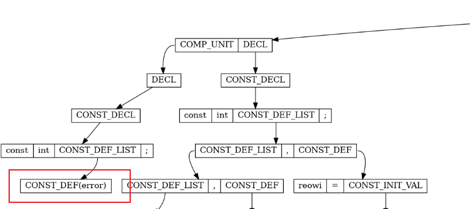
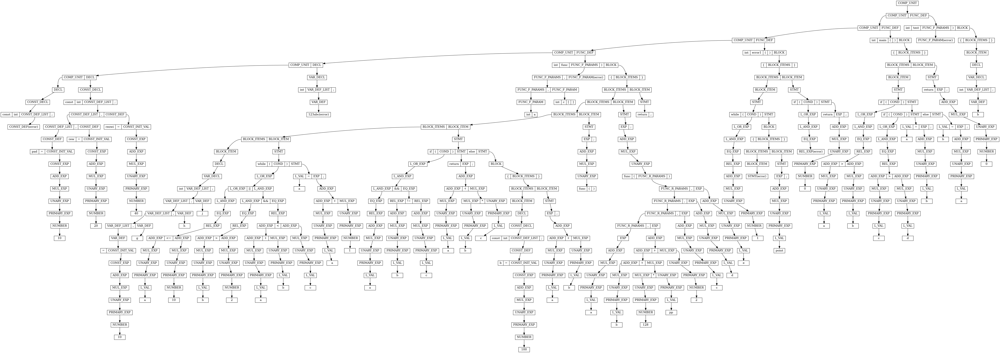
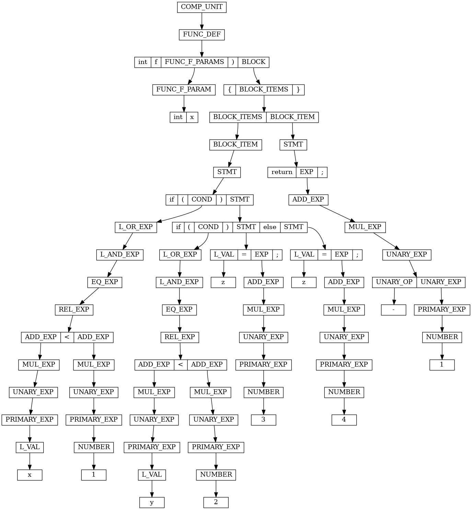

# 语法实验报告

## 文件

```
|--- lab2
|    |--- doc
|    |    |--- report.md (this file)
|    |    |--- report.pdf
|    |--- src
|    |    |--- common.h(.c) (printTree, newNode, etc.)
|    |    |--- lex.l (lexical analyzer)
|    |    |--- syntax.y (syntax analyzer)
|    |    |--- Makefile (makefile and test script)
|    |    |--- test_codes (test codes)
|    |    |    |--- 1.sy
|    |    |    |--- 2.sy
|    |    |    |--- 3.sy
```

## 实验内容

根据 sysY 语言的文档，利用 yacc 编写对应规则的语法分析器，其中 token 需要配合上一阶段的词法分析器。最后用 graphviz 输出语法树。另外~~亮点是~~正确处理了 2.sy 中的错误，能给出错误位置。

> bison (GNU Bison) 3.8.2：最新版的 bison 支持给出冲突的例子，泰裤辣。

## 语法分析器

基本实验步骤：

- 定义所需数据结构：语法树节点。
- 定义 token（相当于终结符）：上一阶段的词法分析器要返回这阶段定义的 token。
- 定义 type（相当于非终结符）。
- 定义语法规则：依照文档抄即可。
- 调整语法规则：通过中间非终结符构造类似出现多次的语法；使用 `%left`、`%right`、`%nonassoc` 调整优先级；使用 `%prec` 调整结合性。
- 编写错误处理
- 生成语法树：遍历语法树，生成 `.dot` 文件。
- 编写测试脚本。

### 数据结构

有两种定义方法，一种是在一个结构体里面包含所有可能需要的字段，第二种是分别定义，然后用 `union` 统一。

这里采用的是第一种。
    
```c
typedef struct Node {
    int id;
    Type type;
    int value;
    char* text;
    int isError;

    struct Node* parent;
    int kChild;  // this node is the kChild-th child of its parent
    struct Node* children[CHILD_MAX];
    int childNum;
} Node;
```

在语法分析器里，使用

```c
%union{
    struct Node* node;
}
```

可以把原本语法分析器里的 `$$` 当做 `Node*` 来使用。

另外在定义语法规则的时候，可以使用 `%type <node> ...` 来提前指定 `union` 中的类型，这样在使用 `$$` 的时候不需要 `$$.node`。

### token

词法分析器现在要在识别出 token 之后，返回语法文件里定义的 token。

此时，词法分析器里的 `yylval` 充当了语法分析器里面 `$$` 的角色，可以通过 `yylval` 来操作语法树上的节点。这里 `yylval` 是 `union` 类型，所以需要用 `yylval.node` 来访问。

### 语法树节点维护

对于终结符，创建节点后需要将 `yytext` 拷贝进去。

对于非终结符，需要把 `$1` 等孩子节点加到当前节点的孩子列表里面，同时维护基本的信息，比如 `parent`、`kChild`、`childNum`。

比较特别的是错误处理，这里的做法是识别到 `error` 后会创建一个叶节点，类型是当前处理的 type，然后在 `Node` 里标记 `isError` 为 `1`，后续特殊处理。

### 语法规则

出现 0 或 1 次的语句只需要写两种情况即可。

比较特别的是类似 `{1,2,3,4}` 的语句识别，这里需要用到中间非终结符，一般的形式是

```
InitValList : '{' InitValListItems '}'
            | '{' '}'
            ;

InitValListItems : InitValListItems ',' InitVal
                  | InitVal
                  ;

InitVal : NUMBER ;
```

-----

另外比较特别的是 `if if else` 移进规约冲突，这里需要用到 `%prec` 来调整结合性。

这里，多定义一个 `%nonassoc` 的 token `IFX`，将它排在 `ELSE` 之后。然后在 `if` 语句的规则里面加上 `%prec IFX`，表明此规则具有 `IFX` 的优先级。`%nonassoc` 在这里没有实际意义，只是必须从 `%left`、`%right`、`%nonassoc` 中选一个，这里其不能结合，所以用 `%nonassoc`。

```
%nonassoc IFX
%nonassoc ELSE

stmt: 
   IF expr stmt %prec IFX
   | IF expr stmt ELSE stmt
```

如此，在选择

```
  Example: IF LEFTP Cond RIGHTP IF LEFTP Cond RIGHTP Stmt • ELSE Stmt
  Shift derivation
    Stmt
    ↳ 59: IF LEFTP Cond RIGHTP Stmt
                               ↳ 60: IF LEFTP Cond RIGHTP Stmt • ELSE Stmt
  Reduce derivation
    Stmt
    ↳ 60: IF LEFTP Cond RIGHTP Stmt                              ELSE Stmt
                               ↳ 59: IF LEFTP Cond RIGHTP Stmt •
```

的时候，会先让 `ELSE` 移进。这里另外一个原理是，一个语句如果没有用 `%prec` 显示指定优先级，则会用最后一个 `token`（终结符）的优先级。

----

一般的语法规则里还常常遇到 `1+2*3`，`1--2*3` 这样的优先级问题需要处理，但 sysY 的语法设计避免了这些问题，所以我们不需要处理。

### 语法树生成

为了方便输出，在语法规则里额外加了一个 `Start` 非终结符，作为根节点。

生成语法树时，首先按层遍历，分配 id，排序。

每个生成式对应的节点信息会被保存到其父节点对应的 `id` 上，比如 `A : X Y Z` 则 `A->id` 对应的节点实际上保存着 `X|Y|Z`。

在生成边的时候，因为我们维护了 `kChild` 指示自己是父节点的第几个孩子，所以可以正确地生成从 `parent->id` 的第 `kChild` 块到 `id` 的边。

对于错误的节点，我们也会正常显示，但节点标题会多输出一个 `(error)` 后缀。

### 错误处理

error 也会有冲突。

比如

```
A : X
    | Y
    | Z
    | error
    ;
```

是可以的，但如果 $X$ 也写一条 `X : error` 的规则，那么就会出现规约冲突。

删掉 `A : error`，但同时写 `X : error` , `Y : error` 也会冲突。

一种策略是，不要在直接推导出 `error` 的规则里面再写 `error` 规则。比如 $A \to X$ 时就不要都写，最好只在最深的写，这样信息最多。

另一个策略是强行给每个规约加上优先级，这个优先级事实上只对错误时有意义。当然，这只是避免报错，实际上 yacc 默认在冲突时就是顺序执行，所以只要你不管那些 warning，那么默认行为就是可以采用的。

但实际上，error 作为一个奇妙的通配符，它非常容易冲突，一个能保证正确显示错误位置的方法是在根节点处添加一个 `error` 规则，这样保证所有错误都能被捕获。

但这样就丢失了部分已匹配的信息，我们希望这个错误能够被识别得足够局部，其他部分的语法结构还能正常被识别出来，所以具体这里怎么设计还会继续研究。本质上，目前提交的代码的做法都是控制粒度，出错的时候直接越过这个粒度读下一个语法单元。

报错信息展示：

```
test_codes/2.sy:1:15: error: syntax error
test_codes/2.sy:3:5: error(lex): Wrong ident: 123abc
test_codes/2.sy:22:19: error: syntax error
test_codes/2.sy:24:14: error: syntax error
test_codes/2.sy:35:12: error: syntax error
```

识别到 `const int abc;` 时语法树上的错误节点显示：

> sysY 中，常量需要立刻初始化。



### 语法树展示

`2.sy` :



`simple.sy` :

```c
int f(int x){
  if (x < 1)
    if (y < 2)
      z = 3;
    else
      z = 4;
  return -1;
}
```

